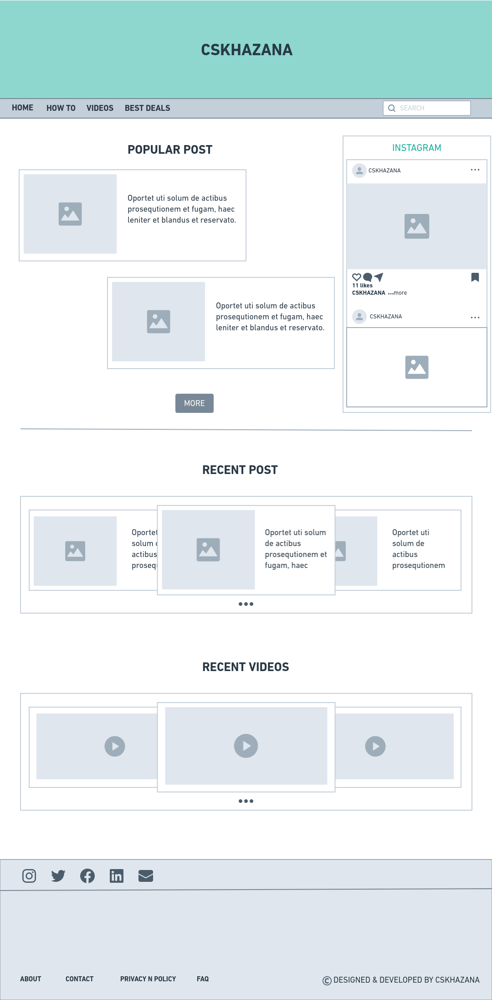
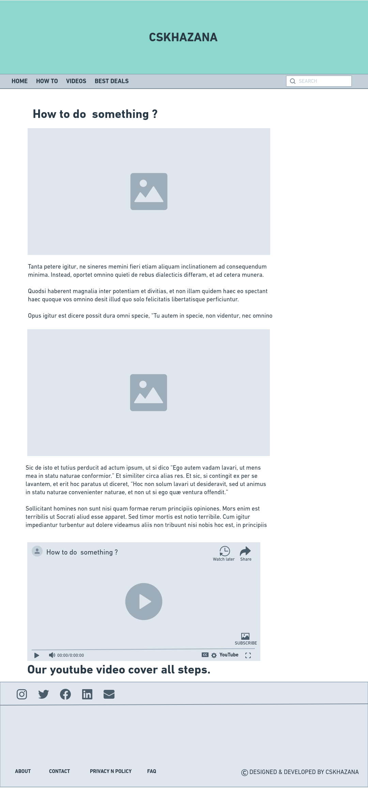
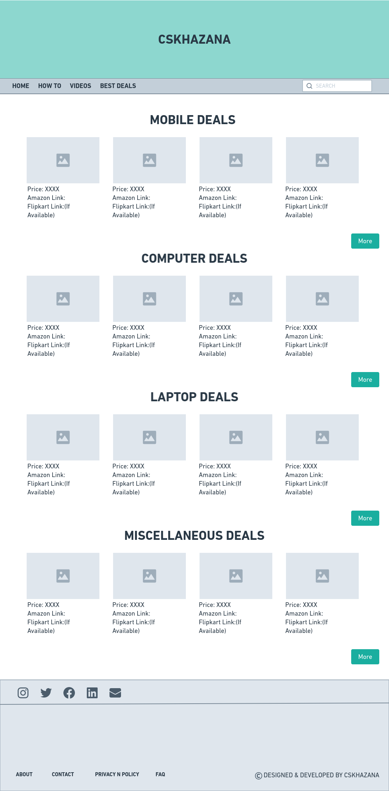

## CSKHAZANA
A website for tech-related problem's solution, Followed by tutorial videos.
This website has also a best deal page which has many tech-related best deals like: Mobile devices, Computer's Components, etc.
 
 

### Languages and Tools Used:

 
 

## Screenshots

  

 

 
 

## LicenseMIT © [Ankesh054-official](https://github.com/Ankesh054-official)

 

